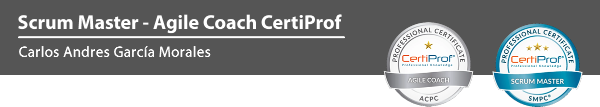

# Description

This Repository shows basic aspects of the role of an Agile Coach.

Job portals in all countries show figures of the need for this role, their responsibilities and their income.

Here you will find basic aspects of the Agile Coach role. where I will show a quick view of the concepts that prepare for the global certification ACPC (Acronym in English) Agile Coach Professional Certificate from CertiProf.

# About Scrum

Scrum is a framework for agile software development.

It is a process in which a set of good practices are applied regularly to work collaboratively, as a team and obtain the best possible result from projects, characterized by: 1

Adopt an incremental development strategy, rather than full product planning and execution.
Base the quality of the result more on the tacit knowledge of people in self-organized teams, than on the quality of the processes used.
Overlap different stages of development, rather than performing one after the other in a sequential or cascade cycle.

# General Content

- Agile Coach's Role in Organizations
- Key Concepts of Agile Coaching
- Tools for Agile Coach
- Fundamentals of Agile Coach Professional Certificate (ACPC)

## :sagittarius: Author

> :man: Carlos Andres Garcia Morales

> :e-mail: [E-mail](agzsoftsi@gmail.com)

> :octocat: [Github](https://github.com/agzsoftsi)

> :bird: [Twiiter](https://twitter.com/karlgarmor)

> :blue_book: [Linkedin](https://twitter.com/karlgarmor)

> :globe_with_meridians: [WebPage](https://www.agzsoftsi.tech/)

